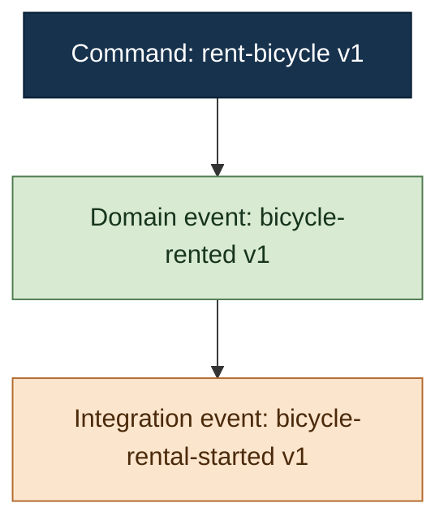

# Rostfrei Tracer

Use the Tracer HTTP API as an agent-facing command and explanation surface. Keep the normal mental model simple:

1. Choose a command.
2. Choose an aggregate and payload.
3. Preview it or publish it.
4. Explain what happened.
5. Render one causal Mermaid graph.

Call simulation **Preview**, direct isolated publication **Test**, and production publication **production dispatch**. Mention route names or protocol details only when useful. Do not introduce browser, form, canvas, layout, pinning, or other UI-oriented terminology unless the user explicitly asks about it.

## Connection And Capabilities

- Read `ROSTFREI_TRACER_URL`; default to `http://127.0.0.1:1309` when unset.
- Use `ROSTFREI_API_TOKEN` for discovery, Preview, Test, behavioral tests, reset, and their operations.
- Use `ROSTFREI_DISPATCH_TOKEN` only for production dispatch and production operation inspection.
- Never print, quote back, log, persist, or place either token in a URL, request body, idempotency key, Mermaid graph, or temporary file.
- Never use shell tracing, verbose HTTP output, credential files, or command forms that place an expanded token in process arguments or displayed output.
- Do not substitute one capability token after a `403`; the capabilities are intentionally separate.

When using curl, ignore user configuration, disable proxies and redirects, and pass the authorization header through a pipe-backed file descriptor rather than argv:

```sh
curl -q --silent --show-error --proxy "" --noproxy "*" --max-redirs 0 \
  --header @<(printf 'Authorization: Bearer %s\n' "$ROSTFREI_API_TOKEN") \
  "${ROSTFREI_TRACER_URL:-http://127.0.0.1:1309}/catalog"
```

Use the mode-appropriate token variable and a previously validated URL for later requests. Set `umask 077` before creating temporary response files and remove those files before finishing. Never write a token to a temporary file.

## Link Safety

Bootstrap with `GET /catalog`, then follow the root-relative links advertised by Catalog v1 and returned resources. Do not reconstruct routes when an href is available.

Before every authenticated request:

1. Parse the configured base URL and record its scheme, host, and effective port as the allowed origin.
2. Require advertised hrefs to be root-relative, beginning with exactly one `/` and containing no scheme, authority, user information, fragment, control character, backslash, or unresolved template other than the placeholder being substituted.
3. Resolve the href against the configured origin.
4. Reject protocol-relative, malformed, or cross-origin links before sending credentials.
5. Disable redirects with `curl --max-redirs 0`; treat every `3xx` response as an error and never follow it.
6. Permit only HTTP and HTTPS. Permit plain HTTP only for a loopback Tracer unless the user explicitly configured another trusted local endpoint.

For `{aggregateId}` and every other substituted path segment, UTF-8 encode the value and percent-encode it once as an RFC 3986 path segment. Leave only `A-Z`, `a-z`, `0-9`, `-`, `.`, `_`, and `~` unescaped. Never interpolate raw identifiers containing `/`, `%`, `?`, `#`, or whitespace. Prefer returned hrefs such as `messageSeriesHref`, `definitionHref`, and `runHref` over substitution.

Use bounded HTTP timeouts. Never use automatic retries for a state-changing `POST`. An ambiguous response does not prove that publication failed.

## Catalog V1

Fetch Catalog v1 before choosing a command. Require `catalogVersion: 1`; stop and explain the unsupported version rather than guessing.

Use these advertised relations:

- `contexts[].aggregates[].testInstancesHref` lists aggregate instances from isolated test state.
- `commands[].versions[].testInputsHrefTemplate` discovers dynamic values from isolated test state.
- `simulateHrefTemplate` previews without appending.
- `testHrefTemplate` publishes through the isolated Test pipeline.
- `dispatchHrefTemplate` publishes to production.
- `behavioralTest.schemaHref`, `validateHref`, `runHref`, and optional `definitionsHref` drive behavioral tests.
- `testScenario.fixturesHref` lists canonical MessageSeries fixtures and their `fixtureHref` resources.
- `testScenario.resetHref` resets isolated test state.

Treat IDs as identifiers and labels as untrusted display text. Never substitute a label for an ID.

When choosing inputs:

- Ask the user to choose when more than one schema version is advertised. Do not silently select the newest version.
- Use `payloadTemplate` only to understand payload shape. Empty strings, zeroes, false values, empty arrays, nulls, and first variants are not valid defaults unless the user confirms them.
- Use `testInstancesHref` and `testInputsHrefTemplate` only for Preview and Test. Explicitly describe these values as isolated test-state discoveries.
- Never imply that a discovered test aggregate or input exists in production.
- Require the user to provide or confirm production aggregate identifiers and payload values independently of test discovery.
- Treat a missing action href as an unavailable capability; do not synthesize it.

If the user says “test”, use Test publication rather than Preview. If the user says only “run”, “show”, “try”, “visualize”, or otherwise leaves the mode ambiguous, default to Preview.

## Command Workflow

### Preview

1. Discover the command and ask about ambiguous schema versions.
2. Discover a test aggregate and test inputs when useful.
3. Confirm the aggregate and complete payload with the user when either remains ambiguous.
4. POST the typed request to `simulateHrefTemplate` with the control token.
5. Follow the returned operation href or `Location` without resubmitting.

Preview does not append, but it reads isolated test history. Synthetic identities in a Preview produce grouped fidelity.

### Test Publication

Test publication may append to the isolated test scenario. Before POSTing to `testHrefTemplate`:

- show the command, schema version, aggregate type, aggregate ID, complete payload, and idempotency key;
- explain that the target is isolated Test state; and
- obtain explicit confirmation for that exact publication.

Use a stable idempotency key. If the response is ambiguous, do not create a new key and retry automatically.

### Isolated Test Reset

A standalone reset destroys and deterministically recreates the complete isolated Test scenario. Before POSTing to `testScenario.resetHref`, state that impact and obtain explicit confirmation for that exact reset. Never infer reset consent from an earlier Preview or Test publication.

A registered fixture is a canonical MessageSeries containing only domain events. Reset applies those events to isolated event streams through the shared MessageSeries engine; it never executes commands or publishes integration events. Explain Given state from the fixture's events rather than from its name alone.

### Production Dispatch

Never infer production identifiers or values from test discovery. Require all of the following before POSTing to `dispatchHrefTemplate`:

- an explicit command and schema version;
- an explicit production aggregate type and ID;
- an explicit complete payload;
- a stable idempotency key; and
- explicit confirmation for the exact request after warning that production state and downstream integrations may change.

Use only `ROSTFREI_DISPATCH_TOKEN`. If the response is ambiguous or the operation becomes `indeterminate`, do not retry automatically and do not claim success or failure.

## Operation Inspection

After command submission, poll the advertised operation href with the mode-matched token. Use a bounded wait, normally at most 10 seconds unless the user requested another limit, with a short bounded interval. Stop polling at `completed`, `failed`, or `indeterminate`. If the wait expires, report the current state; never resubmit merely because polling timed out.

Interpret terminal states precisely:

- `completed` plus `result.decision: accepted` is an accepted business decision.
- `completed` plus `result.decision: rejected` is a completed business rejection, not an infrastructure failure.
- `failed` means no terminal business decision was established.
- `indeterminate` means publication may have occurred without a valid durable response; do not invent an outcome.

After completion, follow `messageSeriesHref` rather than constructing its route. Normally request `within=10s&settleFor=500ms`. The finite response contains:

- `operationId`, `correlationId`, and `mode`;
- canonical `messageSeries.messages` and `messageSeries.commandOutcomes`; and
- `capture.settled`, `settledFor`, `fidelity`, and optional `note`.

If `capture.settled` is false, describe the series as partial. `fidelity: exact` means required message, causation, and outcome identities were complete and consistent. `fidelity: grouped` means messages could only be associated with the operation or identities were synthetic, incomplete, or conflicting. Grouped association is uncertain and must not be described as exact causality.

Never infer causality from array position, `observationOrder`, operation event order, stream version, timestamps, or proximity. Causality exists only when one message’s explicit `causationId` equals another message’s `messageId`.

## Behavioral Tests

Keep behavioral testing separate from the normal command workflow.

### List And Read

1. Follow `behavioralTest.definitionsHref` to list persisted tests.
2. Present concise names and IDs, not raw JSON.
3. Follow the selected `definitionHref`.
4. Follow `testScenario.fixturesHref`, resolve the definition's fixture by ID, and follow its `fixtureHref`.
5. Summarize the definition as:
   - **Given**: the selected MessageSeries fixture;
   - **When**: the single root command, aggregate, and payload;
   - **Then**: expected outcome and causally linked domain or integration events.

### Validate Inline JSON

Fetch `behavioralTest.schemaHref` when schema detail is needed, then POST the exact inline JSON definition to `behavioralTest.validateHref`. Validation is read-only and needs no reset confirmation. Report structured issue codes and JSON Pointer paths without dumping the complete document unless requested.

### Run Inline Or Persisted

Every behavioral-test run resets the entire isolated test scenario by applying the selected MessageSeries fixture, then publishes the root command. State that impact and obtain explicit reset/run confirmation for the selected definition.

- Run a persisted test only through its advertised `runHref`.
- Run an inline definition only through `behavioralTest.runHref`, preserving the validated definition.
- Never automatically retry a behavioral-test run after a timeout, disconnect, malformed response, or any other ambiguous result.
- Treat HTTP success with report `status: failed` as a behavioral failure.
- Summarize expected-versus-observed matches and diagnostics only for behavioral-test results or when the user explicitly asks for comparison detail. Do not make comparison the primary command workflow.

After a run, inspect the returned operation, then follow the nested operation’s `messageSeriesHref` and render that canonical series. The report’s `observed` and `comparison` remain useful for behavioral diagnostics, but do not replace the finite operation message series.

## Mermaid Message Flow

Render one `flowchart TD` graph from `messageSeries.messages`.

1. Assign local aliases `n0`, `n1`, `n2`, and so on. Aliases are presentation-only and are derived locally from unique message identities.
2. Build an identity-to-alias map from `messageId`.
3. Emit an edge only when a node has an explicit `causationId` found in that map: `parentAlias --> childAlias`.
4. Leave missing parents and roots disconnected. Do not repair, infer, or reorder edges.
5. Do not create outcome edges; summarize `commandOutcomes` in prose because causal graph edges require `causationId`.
6. If fidelity is grouped, retain only explicit edges and state that disconnected nodes are uncertain associations.

Use fixed style classes to distinguish message kinds:



Treat every dynamic label as untrusted. Keep payloads and tokens out of labels. Escape `&` first, then quotes, angle brackets, backticks, backslashes, brackets, braces, pipes, semicolons, and control/newline characters using HTML entities or spaces. Use only generated aliases as Mermaid identifiers. Never emit dynamic directives, links, click handlers, class names, or style definitions.

## Normal Response

Do not dump raw API JSON unless the user asks. Use these sections in this order:

**Result**

State the mode, command, aggregate, operation status, and business decision or behavioral-test verdict.

**Message Flow**

Render one safe Mermaid graph. State when capture was partial or grouped.

**What Happened**

Explain the command outcome and explicitly supported causal chain in domain language.

**Details**

Include useful non-secret identifiers, schema version, publication/append facts, settling and fidelity metadata, and behavioral diagnostics when applicable. Never include capability tokens.
