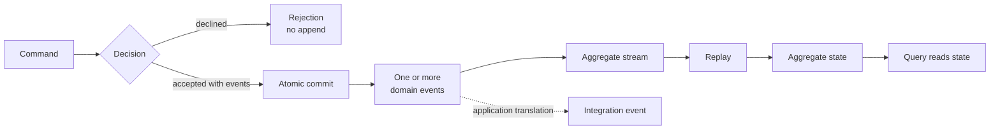
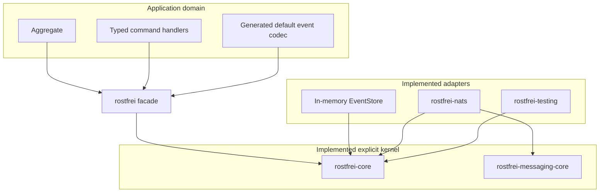
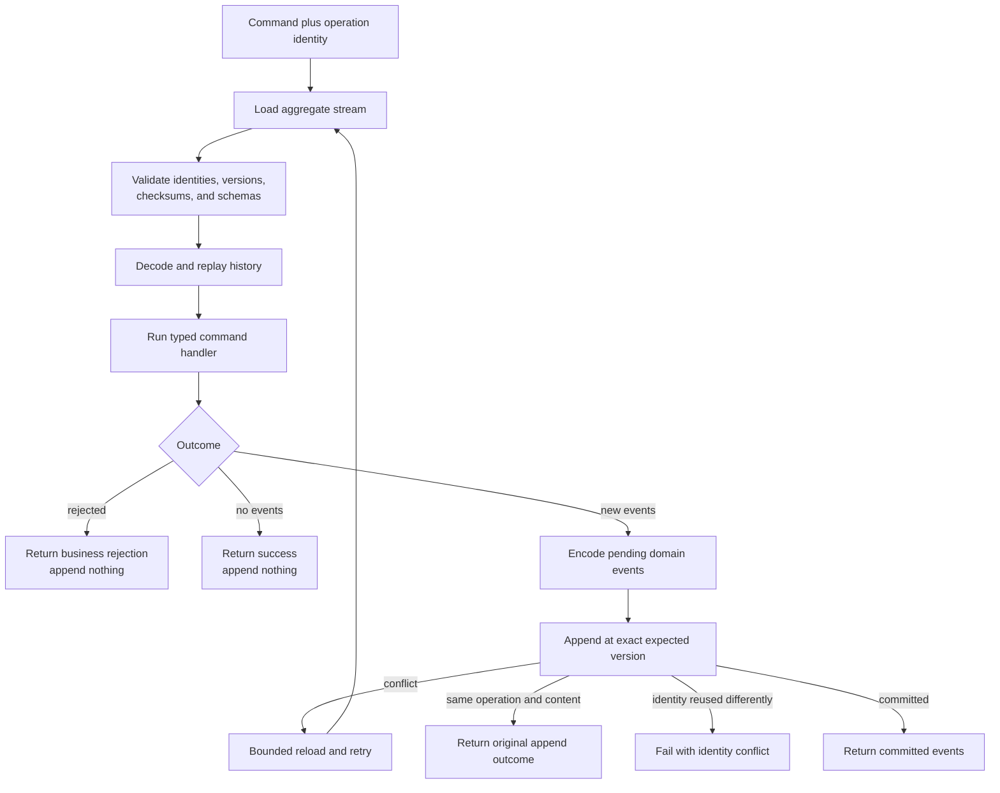
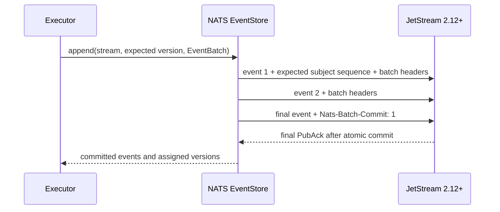
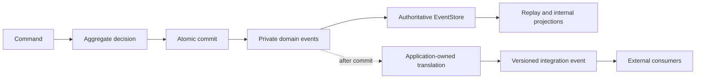
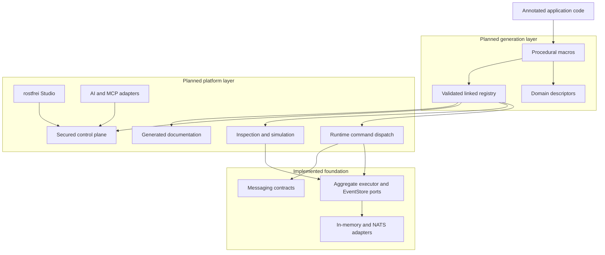
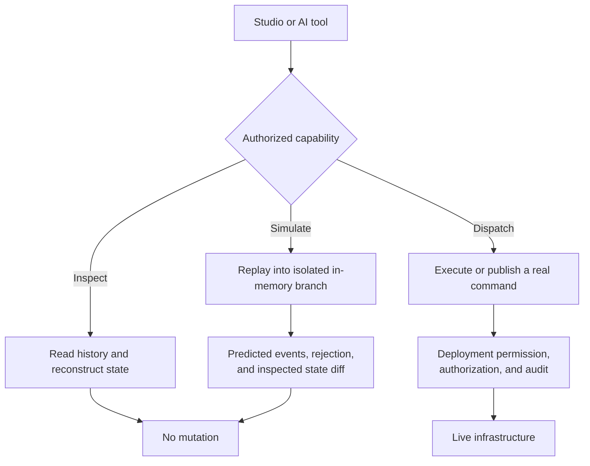
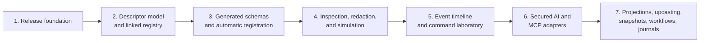

# rostfrei cofounder project summary

Status as of 2026-08-26.

## Executive summary

rostfrei is an event-sourced development platform for building, testing,
operating, and understanding business systems whose decisions must remain
traceable over time.

The implemented foundation is a Rust event-sourcing and messaging framework. It
provides deterministic aggregate execution, permanent domain-event histories,
strict replay, optimistic concurrency, exact operation retry, atomic event
commits, broker-neutral messaging, NATS JetStream adapters, and reusable testing
contracts.

The accepted product direction adds a machine-readable domain registry,
automatically generated registration, aggregate inspection, safe command
simulation, rostfrei Studio, and AI-facing tools. All of these remain optional
layers around the explicit kernel.

The product thesis is:

> One explicit domain model should power production execution, historical
> replay, testing, visualization, documentation, and AI-assisted development.

## Problem and opportunity

Business behavior in conventional systems is distributed across application
services, database rows, message handlers, queues, background jobs, tests, and
documentation. This makes basic operational questions expensive:

- What did the system know when it made a decision?
- Which command caused a state change?
- Which domain events were committed by that operation?
- Why was a command rejected?
- Can a production history reproduce a problem against changed code?
- Will an event-schema change make old histories impossible to replay?

Source-code assistants have the same limitation. Reading code does not provide
an authoritative description of linked handlers, deployed capabilities,
historical state, command outcomes, or runtime schemas.

rostfrei addresses both problems by making decisions explicit, histories
permanent, execution deterministic, and domain metadata machine-readable.

## Current maturity

| Area | Status |
| --- | --- |
| Aggregate and executor kernel | Implemented and tested |
| In-memory EventStore reference adapter | Implemented and contract-tested |
| NATS JetStream EventStore | Implemented; real-server contract tests require NATS 2.12 and `ROSTFREI_NATS_URL` |
| Commands, integration events, and queries | Implemented as broker-neutral contracts with NATS adapters |
| Retry, durable consumption, and quarantine | Implemented |
| Aggregate scenarios and EventStore conformance tests | Implemented |
| Compiled domain model and explicit runtime registration | Implemented; automatic discovery remains deferred |
| Aggregate inspection and simulation | Accepted direction, not implemented |
| Studio model browser | Implemented as a read-only browser and Cargo diagnostic client |
| Runtime Studio and AI control plane | Accepted direction, not implemented |
| Projection orchestration, workflows, snapshots, and execution journals | Deliberately deferred |

The foundation is working and verified locally but has not been released. The
repository has a configured remote and still needs a reviewed release commit,
final CI, and an initial tagged or pinned revision.

## Ubiquitous language

ADR 0001 establishes a ubiquitous language shared by framework APIs,
architecture decisions, documentation, Studio, and AI tooling.

| Term | Meaning |
| --- | --- |
| Aggregate | A business consistency boundary whose handlers make deterministic decisions |
| Aggregate stream | The permanent ordered history of one aggregate identity |
| Aggregate state | Transient state reconstructed by replay, not a separately persisted source of truth |
| Command | A request for an aggregate to make a decision |
| Decision | A rejection or an ordered set of new domain events |
| Rejection | An expected business outcome that appends nothing |
| Domain event | A private meaningful fact in an aggregate's authoritative history |
| Commit | One atomic, non-empty ordered set of domain events produced by an accepted operation |
| Query | A state read that never appends to an aggregate stream |
| Integration event | A separately versioned public contract normally derived after domain events commit |

This vocabulary prevents several dangerous ambiguities:

- Domain events are **appended** to authoritative history; integration events
  are **published** as public messages.
- An aggregate stream is a logical history; a JetStream stream is NATS
  infrastructure that can contain many aggregate subjects.
- A commit is a business atomicity boundary, not an arbitrary message batch.
- Aggregate state is reconstructed from domain events and is not stored in NATS
  KV by rostfrei.
- A rejection is a business outcome, not a codec, storage, or broker failure.

## Implemented architecture

The current workspace has ten framework crates plus the bike-rental example
Cargo package, with deliberately layered responsibilities.

| Crate | Responsibility |
| --- | --- |
| `rostfrei` | Application facade for the compiled domain model, generated event runtime, registry, kernel, and public macros |
| `rostfrei-core` | Aggregates, command execution, replay, identities, event envelopes, and EventStore ports |
| `rostfrei-domain` | Compiled domain identities, structure, behavior metadata, validation, and model projection |
| `rostfrei-domain-macros` | Derives and attributes for the compiled domain language |
| `rostfrei-domain-runtime` | Checked bindings from model-owned commands to executable aggregate handlers |
| `rostfrei-registry` | Deterministic runtime command and module registration |
| `rostfrei-macros` | Standalone command and module derives for kernel-only applications |
| `rostfrei-messaging-core` | Transport-neutral commands, integration events, queries, envelopes, and delivery contracts |
| `rostfrei-nats` | NATS connections, messaging adapters, durable consumption, quarantine, provisioning, and EventStore implementation |
| `rostfrei-testing` | Aggregate scenarios and reusable EventStore contract suites |

The dependency direction is intentional. Aggregates do not receive Serde,
broker headers, clocks, IDs, NATS clients, repositories, or storage handles.
They own typed decisions and deterministic state transitions only.

The executor owns the orchestration around the aggregate:

This separation allows typed domain tests to run without NATS or serialization
while every EventStore adapter must satisfy the same observable contract as the
in-memory implementation.

## Authoritative domain-event storage

Domain events are stored in NATS JetStream, but they do not use the general
application-message publisher. The executor encodes an `EventBatch` and appends
it through the `EventStore` port. The NATS adapter performs broker publication
as the infrastructure mechanism behind that append.

Each domain event is one bounded, checksummed JetStream message containing its
event data and operation, commit, ordinal, count, and identity metadata. One
opaque subject identifies one aggregate stream.

Multi-event commits use the NATS ADR-50 atomic batch protocol:

The storage guarantees are:

- One JetStream message per domain event.
- All events from one accepted operation become visible atomically.
- The final domain event commits the batch; there is no extra commit-marker
  message.
- Every domain event receives its own aggregate version and JetStream sequence.
- The maximum commit contains 1,000 events.
- Exact retry remains valid after reconnects, restarts, later commits, and broker
  deduplication-window expiry.
- Missing events, version gaps, checksum failures, incompatible schemas, and
  inconsistent identities fail closed.
- NATS KV is not used, histories are never rewritten, and aggregate state is
  reconstructed through replay.

Authoritative stream policy is operator-owned. Application startup connects and
verifies configuration but does not silently create or modify production
infrastructure.

## Domain events and integration events

ADR 0004 separates private aggregate truth from public communication.

A domain event is not automatically a public notification. Its schema evolves
for permanent replay. An integration event has its own versioning, address,
compatibility policy, retry policy, and consumers.

The first release provides both contracts but does not orchestrate projections
or an outbox. That boundary remains application-owned until a concrete use case
justifies a framework capability.

## Transport-neutral messaging

Messaging contracts and NATS mechanics are separate.

`rostfrei-messaging-core` owns:

- Validated application and bounded-context names.
- Application-first command, integration-event, and query addresses.
- Bounded envelopes.
- Correlation and causation metadata.
- Publishing ports.
- Consumer dispositions.
- Stable query-error classifications.

`rostfrei-nats` owns:

- Connection lifecycle.
- JetStream publication and PubAck handling.
- Durable pull consumers.
- ACK, NAK, and termination translation.
- Retry and quarantine mechanics.
- Core NATS request/reply and queue groups.
- Broker-header validation.
- Application-derived stream topology and operator provisioning.

Queries use adapter-generated Core NATS inboxes and are never written to
JetStream. Application metadata cannot override broker control headers.
Applications provide one top-level name; rostfrei derives disjoint stream names
and subjects. Domain-event streams additionally include their bounded context.

## Truthful legacy import

ADR 0007 requires existing state to enter a new aggregate stream through an
honest import domain event. rostfrei does not fabricate a sequence of business
events from a current-state row and does not hide imported state in a snapshot.

An import is a normal `NoStream` commit and can include domain-selected
provenance such as source system, source record, observation time, and import
batch.

This keeps aggregate history truthful: imported knowledge is represented as
imported knowledge rather than invented history.

## Accepted platform direction

ADRs 0009 through 0012 define the next product layer while preserving the
kernel's independence.

The descriptor model will cover aggregate types, commands, events, schema
versions, aggregate targets, rejections, handlers, codecs, and inspection views.
Runtime dispatch, tests, Studio, documentation, compatibility checks, and AI
will consume the same registry.

Annotated aggregates and handlers will automatically contribute generated
registrations through a compile-time or link-time registry. At startup,
rostfrei will collect, sort, and validate the linked registrations. Duplicate
names, ambiguous handlers, or incompatible descriptors will fail startup or,
where possible, compilation.

Applications will not normally maintain a runtime list of aggregate modules or
handlers. Manual registration remains an internal and testing escape hatch.
Automatic domain registration will not choose infrastructure, stream policy,
command buses, or deployment environments.

## Inspection, simulation, and dispatch safety

ADR 0011 defines three separate capabilities rather than one generic command
console.

Inspection is separate from aggregate persistence and event codecs. Aggregate
state does not need to implement Serde or become a durable public schema. An
inspection adapter creates a developer-facing view and applies field omission
and redaction before data leaves the runtime.

Simulation uses the normal typed command handler against replayed history but
does not append authoritative events or publish messages. This is safe for the
current deterministic handler model. Commands involving external effects need a
future execution-journal seam before they can be represented as safely
simulatable.

Live dispatch is disabled unless deployment configuration, authorization, and
auditing explicitly permit it. The UI and API must make simulation and live
dispatch technically and visually distinct.

## Studio and AI control plane

ADR 0012 establishes one protocol-independent control plane for humans and AI.
It will expose:

- Domain descriptors and registered handlers.
- Aggregate-stream inspection.
- State reconstruction at a selected version.
- Command simulation.
- Operation tracing.
- Scenario generation and execution.
- Explicitly authorized live dispatch.

rostfrei Studio and AI adapters use the same validation, redaction,
authorization, environment capabilities, and audit trail. AI does not receive a
privileged route around production safety.

HTTP, WebSocket, MCP, and future protocols are adapters around this control
plane. None of those protocols become dependencies of the aggregate kernel.
Deployments can expose inspection without dispatch or omit the control plane
entirely.

## Architecture decision summary

| ADR | Decision | Product significance |
| --- | --- | --- |
| [0001](adr/0001-ubiquitous-language-and-scope.md) | Canonical ubiquitous language and framework ownership | Runtime, documentation, Studio, and AI use one vocabulary |
| [0002](adr/0002-aggregate-codec-executor-store.md) | Separate aggregate, codec, executor, and EventStore responsibilities | Domain behavior remains deterministic and infrastructure-independent |
| [0003](adr/0003-stream-version-idempotency.md) | Exact versions, atomic commits, and persisted retry identities | Prevents lost updates, partial decisions, and ambiguous retries |
| [0004](adr/0004-private-and-integration-events.md) | Private domain events are separate from public integration events | Internal history and public contracts can evolve independently |
| [0005](adr/0005-nats-event-store.md) | One JetStream message per domain event with ADR-50 atomic commits | Provides authoritative replayable history without KV storage |
| [0006](adr/0006-messaging-boundaries.md) | Broker-neutral messaging with broker-owned adapter mechanics | Applications do not couple business policy to `async-nats` |
| [0007](adr/0007-legacy-import.md) | Existing state enters through truthful import events | Preserves historical honesty and provenance |
| [0008](adr/0008-nexus-release-strategy.md) | Independent release and thin integration facade | Applications compose rostfrei without duplicating its generic adapters |
| [0009](adr/0009-development-platform-layers.md) | Optional platform layers around the stable kernel | Higher-level product capabilities do not compromise the foundation |
| [0010](adr/0010-domain-descriptors-registration-and-macros.md) | Shared descriptors and automatic generated registration | Runtime, tests, UI, documentation, and AI share one declared model |
| [0011](adr/0011-inspection-simulation-and-dispatch.md) | Inspect, simulate, and dispatch are distinct capabilities | Real histories can be explored safely without accidental mutation |
| [0012](adr/0012-studio-and-ai-control-plane.md) | Studio and AI share one secured control plane | Humans and AI receive the same behavior and security constraints |
| [0013](adr/0013-domain-event-handlers.md) | Typed post-commit domain-event handlers and durable NATS dispatch | Side effects consume committed facts without entering aggregate decisions |
| [0014](adr/0014-compiled-domain-model.md) | The domain compiler is rostfrei's canonical optional platform model | One declaration drives metadata and the generated aggregate runtime |
| [0015](adr/0015-application-scoped-nats-conventions.md) | Application-first subjects and derived NATS topology | Applications sharing an account retain disjoint messaging and event storage |

## Known boundaries and deliberate omissions

The ADRs intentionally do not claim that the first release solves every
distributed-systems concern:

- Successful decisions that produce no events do not yet have a durable retry
  receipt.
- External side effects are not made atomic by appending domain events.
- Projection and outbox orchestration are not currently supplied by the
  framework.
- Procedural domain macros and the read-only Studio model browser are
  implemented. Handler discovery, generated wire schemas, runtime Studio views,
  and AI tools remain deferred.
- Snapshot policy, event upcasting, process managers, and workflows remain
  deferred until concrete use cases establish their contracts.
- NATS Server 2.12 or newer is required for the authoritative NATS EventStore.
- Streams created by the unreleased earlier one-message-per-commit prototype
  must be recreated; there is no compatibility decoder for pre-release data.

## Delivery roadmap

The implementation order matters. Descriptor and registry contracts must be
proved independently before macros automate them. Inspection and simulation
must be safe before Studio or AI can expose them. Advanced runtime capabilities
should be added only when real use cases establish their required semantics.

## Strategic position

rostfrei combines capabilities normally separated across an event-sourcing
framework, message-bus abstraction, EventStore, aggregate testing library,
domain debugger, operational inspection tool, and AI development interface.

The advantage is not the number of features. It is that every layer shares the
same vocabulary, descriptors, execution model, and historical truth.

rostfrei is therefore not simply an attempt to reproduce another framework in
Rust. Its intended differentiator is:

> Every important business decision should be reproducible, explainable,
> testable, visualizable, and safely accessible to both humans and AI.
